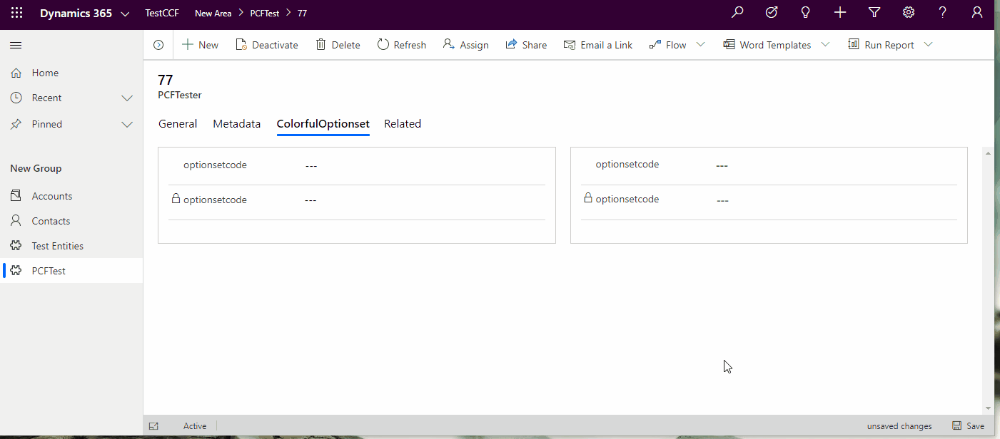
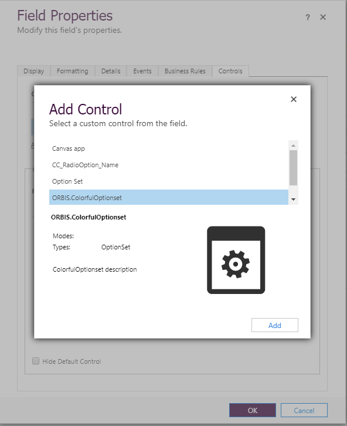
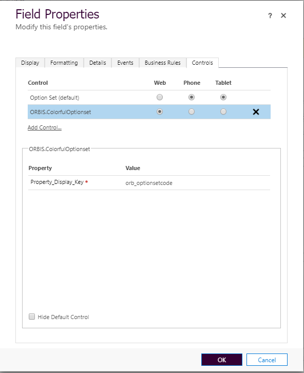
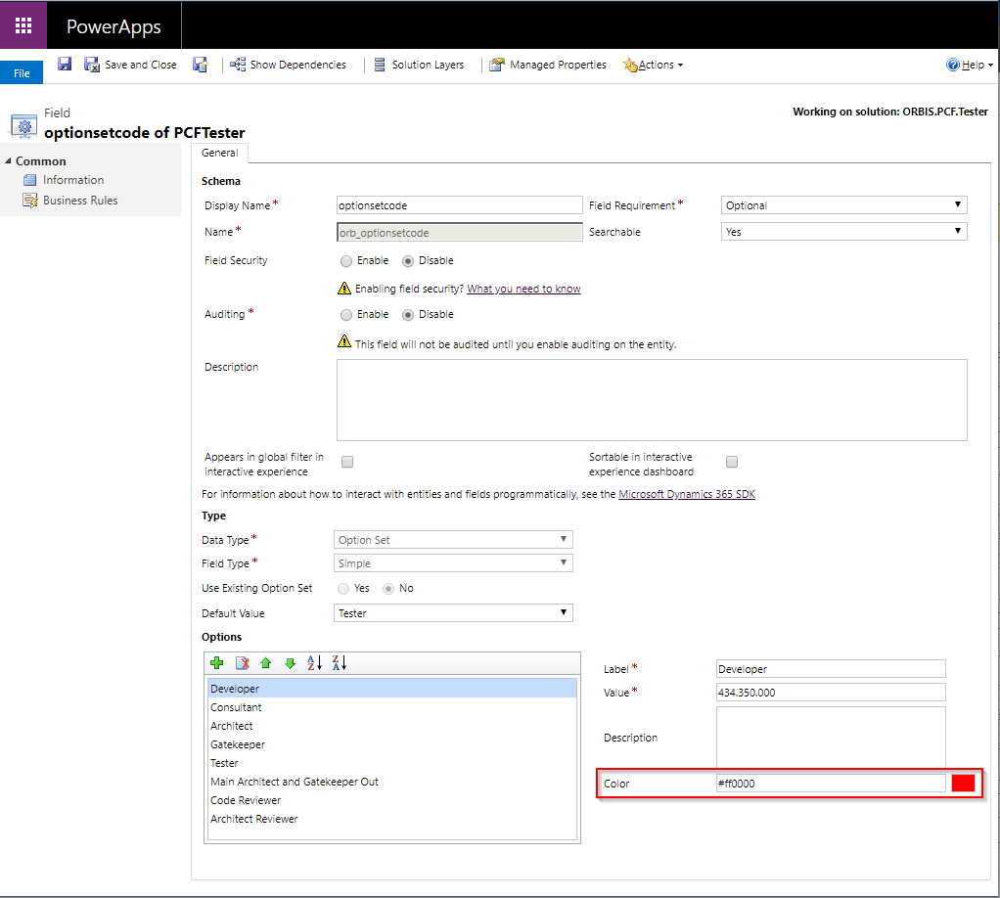
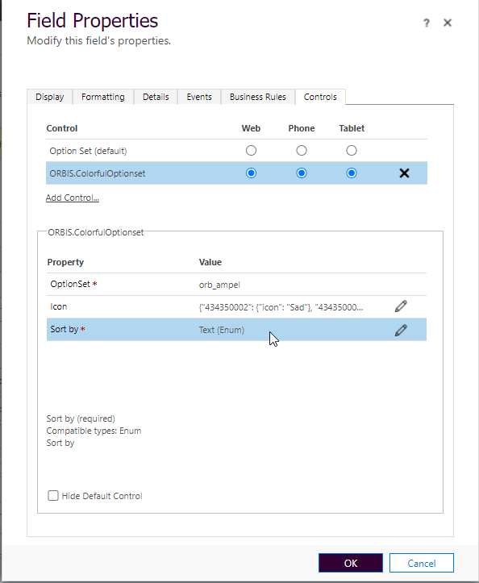

# ORBIS.PCF.ColorfulOptionset
This control is an optionset control for model driven apps (Dynamics 365) reflecting the options color provided in the customizing. The control is build using [office-ui-fabric-react](https://github.com/OfficeDev/office-ui-fabric-react). 

Note: Right now it only support single optionset controls.

## Control Preview

On the left side you see two instances of the control (the second is disabled). On the right side you can see the standard OptionSet control.

## Install

1. Download the latest version of the solution from [releases](https://github.com/ORBISAG/ORBIS.PCF.ColorfulOptionset/releases).
2. Import the solution to your Dynamics365CE instance

## Registering the control

After you install the control, you should be able to select the control from the list of available controls for an optionset field.




## Customizing the colors

Right now only the classic UI allows you to customize the colors and the control on the form.
This control is designed for Optionset attribute types. In order to define the colors, navigate to attribute (Field) customization, select each option and set the color code.



## Icons

To customize the icons, you can choose the icons from the [FluentUI Icons](https://uifabricicons.azurewebsites.net/)

Just define it for the icon parameter. If not, the default will be the "dot".


### Different icons
If you need different icons for different options, you can specify a JSON for the icon parameter. The structure will be {value: {icon, color}}
Here is an example
```javascript
{"434350002": {"icon": "Sad", "color": "#ff0000"}, 
"434350001": {                "color": "orange"}, 
"434350000":{"icon":"Emoji2"}}
```

- If the "color" is not specified, the color from the Options Metadata will be taken.
- If the "icon" is missing, the "dot" will be shown
- You can specify both "icon" and "color" for each option
- You cal leave options not being defined. In that case the fallbacks will be applied.

It will look something like this:


Here is the result of the above configuration (yellow has no icon, so it takes the default):


# Sort by 

Usually the OptionSet (Choice) will list the options in the order defined in the customizing. That will be the default also for ColorfulOptionSet component.
But if you would like to have it sorted by "text", so every user is getting the options alphabetically sorted (doesn't matter which language she/he uses), you can define it by choosing: "Sort by" "Text".



Here is the standard sorting in a out of the box OptionSet control(by Value):


Here is the "Text" sorting in ColorfulOptionSet


## License

[MIT](./LICENSE)
